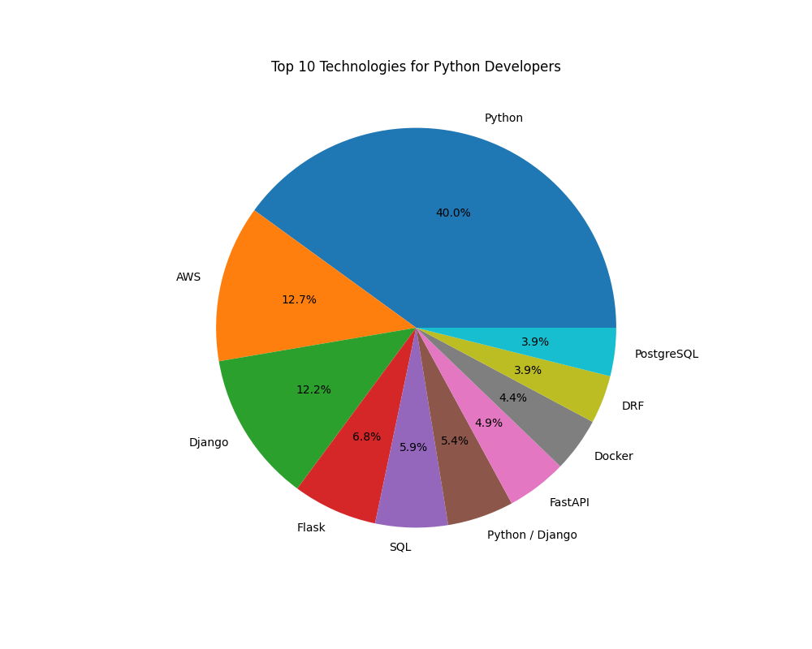
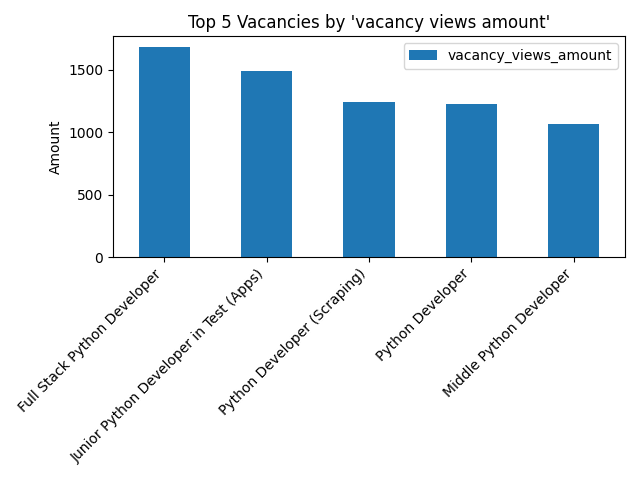
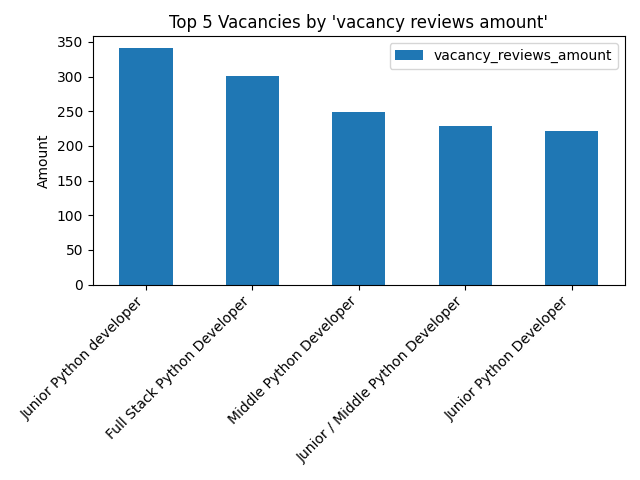

# Python Jobs From Djinni

## Installing:
```shell
git clone https://github.com/barabarinov/python-jobs-from-djinni.git
python -m venv venv
pip install -r requirements.txt
```
## To run scraper use following command:
```shell
scrapy crawl python_vacancies -o vacancies.csv
```
## For data analyze run command:
```shell
python analyze_technologies.py
```
## The result of data analysis



